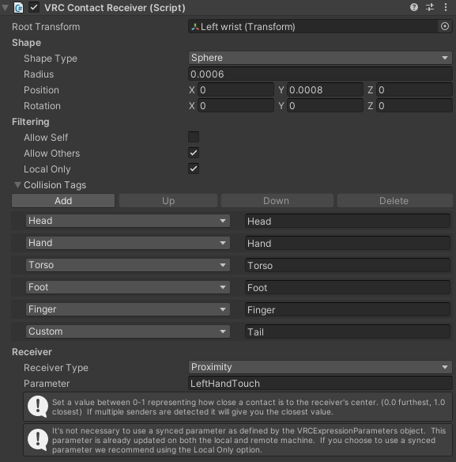

# VRCAvatarOSCToolkit

Provides an alternative to https://github.com/benaclejames/VRCFaceTracking that allows for more than just face tracking

## Why?

Running a VR setup often involves needing to start up a lot of different applications in a specific order and doing a good deal of setup before you can actually get in game and start having fun. I was writing and running multiple different softwares for handling eye tracking, haptic devices, hand tracking, an OSC interface, and it was beginning to get cumbersome starting all these up individually and making sure each was running the right version and everything was working correctly. I started writing this software in an effort to consolidate some of these separate applications into an all-in-one solution providing flexibility to add on more modules in the future, while maintaining compatibility with the avatar standards already set by the VRCFT project. 

## Included Modules
 - **EyeTrackingModule** : Provides EyeTracking capability based on VRCFT for Varjo headsets (support for more headsets to come) 
 - **HapticsModule**     : Buzzes your controllers when your hand comes into contact with another avatar's collider. (technically obsolete now since VRC added this natively to the client)
 - **OSCModule**         : Handles communication to/from VRC using SharpOSC library

## Avatar Setup
Setup steps are specific to each module. In the future, each module should have its own Wiki page describing setup, parameters, and configurations. For now:
 - **EyeTrackingModule** : Follow steps at https://github.com/benaclejames/VRCFaceTracking/wiki/Eye-Tracking-Setup 
 - **HapticsModule**     : You will need to have a VRC Contact Receiver on each of your avatar's hands with the parameters "LeftHandTouch" and "RightHandTouch" respectively.
 
   
 - **OSCModule**         : Your avatar needs to have OSC enabled. Default ports are 9000 for sending and 9001 for receiving OSC messages. Default host is localhost (127.0.0.1). Make sure these ports are available, or change them in SharpOSCNetwork.cs in OSCModule. See https://docs.vrchat.com/docs/osc-overview for more information. 

## Building and Running the project
Currently, the only way to run the project is to build the **AvatarController.sln** from source using **Visual Studio 2022**. Distributed releases will be coming soon.
 
Before running the project, your headset and your controllers must be connected and online. If they aren't, or are not visibile to tracking you will get initialization errors.
Check the Program.cs and make sure all the modules you want to use are being constructed and initialized in code - disable any modules you don't want by commenting out their respective lines. The EyeTrackingModule is dependent upon having a Varjo headset with Varjo Base running (for now) and the HapticsModule has a dependency on OpenVR (SteamVR controllers, i.e doesn't work on Quest). 

## Contributing / External Modules
I started this project basically for myself, and so is specifically tailored to my needs and pretty rough around the edges at this early state. However, I would love for others to be able to get use out of this project and so I'm opening it up and making it available for contribution. You can contribute by submitting feedback through the issues tab, or by forking the repo, or by hitting the star to show your interest in this project. If you'd like to write additional modules to support other hardware or add additional functionality, a Wiki on how to go about doing this is in the works - but for now the HapticsModule and EyeTrackingModules are good examples to look at. Modules should inherit from ModuleBase and should only have dependencies on AvatarController.Infrastructure or external libraries, never on other modules. If you want to send your tracking data to something that isn't OSC (like a RESTApi), this is very possible by writing an INetwork implementation and constructing it in a Module (look at OSCModule). 

